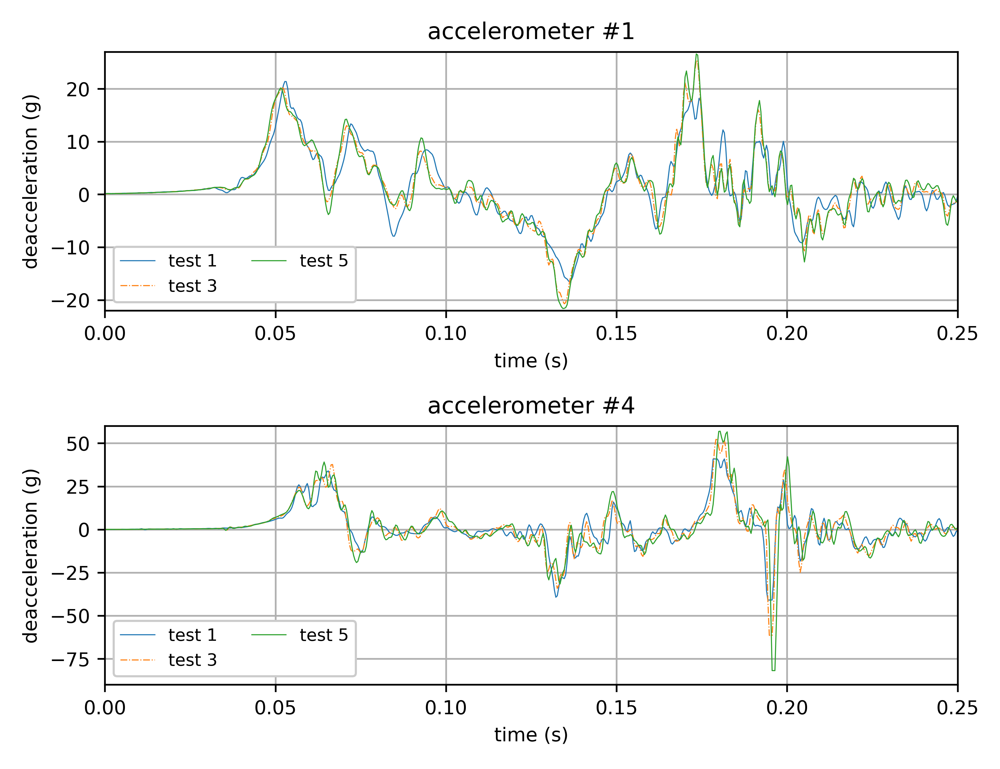
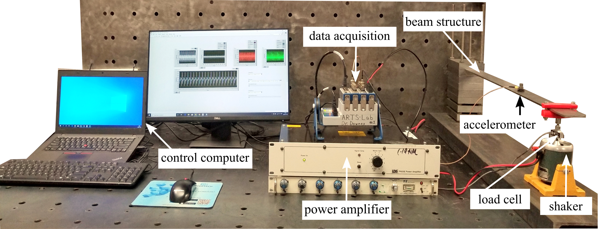

# Dataset-1-quad-PCB-shock-loading
A data set focused on quad PCBs under shock.

Figure 1: Deacceleration data for test 1, 3, and 5. 

Figure 2: Experimental setup of a cantilever beam with key components and data acquisition setup.

