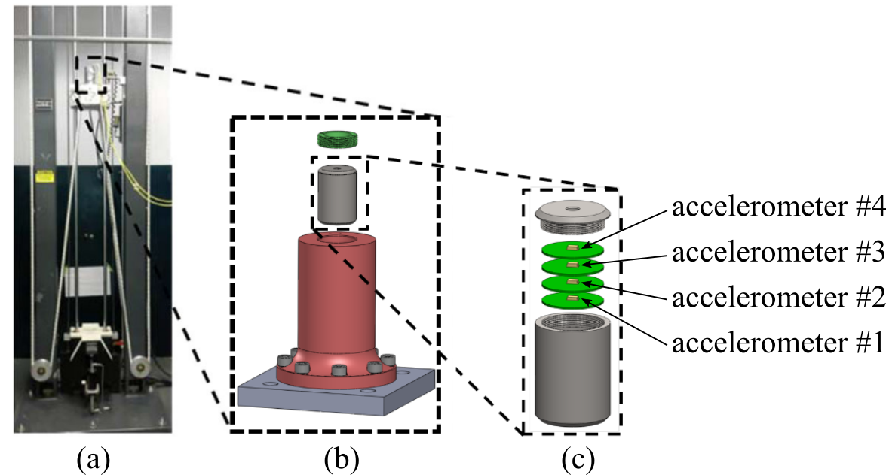
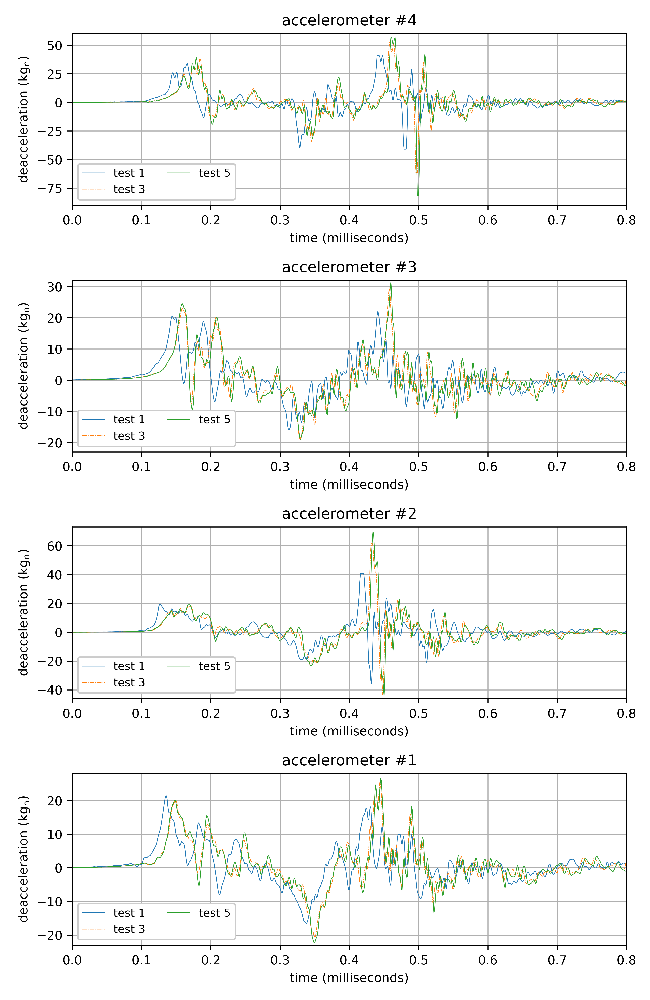

# Dataset-1-High-Rate-Drop-Tower-Data-set 

This dataset contains the measured acceleration data for an electronics unit under shock test. Figure 1 shows the electronics unit which consists of four circuit boards with high-g Meggitt 72 accelerometers mounted on each. The units for the accelerometers are in kgn and are sampled at 1 MS/s. The Meggitt 72 high-g accelerometers are able to accurately measure accelerations of 120,000 gn or 120 kgn, where 1 gn = 9.81 m/s2 = 32.2 ft/s2. The electronics are potted in the canister with potting material to secure all parts in place. The axial fixture is instrumented with a bottom accelerometer (an Endevco7280A-60k) and a top accelerometer (an Endevco7270A-60k) to measure the input into the fixture.

Figure 1: Experimental setup for the quad PCB shock loading data showing the: (a) shock test system;  (b) mounting fixture, and; (c) electronics package.

The test specimen is subjected to 5 repeated tests where slight variations in the signal are observed, presumably caused by damage in the PCBs. Figure 2 shows the deceleration profile from three different tests for a single accelerometer.

Figure 2: Deacceleration data for test 1, 3, and 5 for accelerometer #1 (top) and accelerometer #4 (bottom). 

Figure 3 is presents the experimental test configuration where the package is mounted on a MTS-66 shock test system designed to generate various impact conditions and a video of the test can be found <a href="https://www.youtube.com/watch?v=Azxv1YyBkQw&ab_channel=ARTS-LabattheUniversityofSouthCarolina">here</a>.

  

Figure 3: Video of shock test (click the image to view the video on YouTube). 

This data set was developed at the AFRL to be shared with academic collaborators to provide relevant high-rate data for development of algorithms. The PDF titled "(96TW-2019-0471) High Rate Drop Tower Data.pdf" contains a more detailed discussion of the dataset. 

DISTRIBUTION A: Approved for public release; distribution unlimited (96TW-2019-0471)

This data set has been used in the following publications:
1. Hong, Jonathan, Liang Cao, Simon Laflamme, and Jacob Dodson. "Robust variable input observer for structural health monitoring of systems experiencing harsh extreme environments." (2017).
1. Hong, Jonathan, Liang Cao, Simon Laflamme, and Jacob Dodson. "Variable input observer for state estimation of high-rate dynamics." In Sensors and Smart Structures Technologies for Civil, Mechanical, and Aerospace Systems 2017, vol. 10168, p. 101680S. International Society for Optics and Photonics, 2017.
1. Hong, Jonathan, Simon Laflamme, Jacob Dodson, and Bryan Joyce. "Introduction to state estimation of high-rate system dynamics." Sensors 18, no. 1 (2018): 217.
1. Hong, Jonathan, Simon Laflamme, and Jacob Dodson. "Study of input space for state estimation of high-rate dynamics." Structural Control and Health Monitoring 25, no. 6 (2018): e2159.
1. Hong, Jonathan. "A path for microsecond structural health monitoring for high-rate nonstationary time-varying systems." (2019).
1. Hong, Jonathan, Simon Laflamme, Liang Cao, Jacob Dodson, and Bryan Joyce. "Variable input observer for nonstationary high-rate dynamic systems." Neural computing and applications 32, no. 9 (2020): 5015-5026.

Cite this data as: 

Jacob Dodson, Jonathan Hong, and Alain Beliveau, “Dataset 1 high rate drop tower data set,” Dec. 2019. [Online]. Available: https://github.com/High-Rate-SHM-Working-Group/Dataset-1-High-Rate-Drop-Tower-Data-set

@Misc{Dodson2019Dataset1High,  
  author = {Jacob Dodson and Jonathan Hong and Alain Beliveau},  
  month  = dec,  
  title  = {Dataset 1 High Rate Drop Tower Data set},  
  year   = {2019},  
  groups = {High-Rate-SHM-Working-Group},  
  url    = {https://github.com/High-Rate-SHM-Working-Group/Dataset-1-High-Rate-Drop-Tower-Data-set},  
}  

